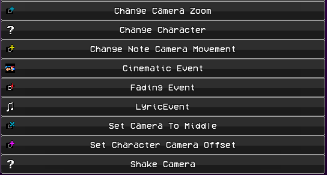

# LJ's Events Pack
Hi!!

Thanks for using my events pack, I hope you enjoy it!

## Features:

    
<h1>Camera Movement</h1>

    
Edited the event so that you can make the camera instantly focus on a character. You can also tween to the character's position. Easing and Time.

    
Event parameters are exactly what they mean.

    

    
<h1>Change Camera Zoom</h1>

    
This changes the defaultCamZoom variable to be that value. You can also tween the value.

    
Instant - instantly changes the zoom value.

    
Additive - adds the value to the current zoom value.

    
Take Snapshot - saves the current zoom value to a snapshot. (A snapshot is taken on creation of PlayState)

    
Reset To Snapshot - resets the zoom value to the snapshot.

    
Time - The time in beats that the tween takes.

    
Tween Ease - ease function. (FlxEase)

    
Tween Type - ease type. (FlxEase)

    

    
<h1>Change Note Camera Movement</h1>

    The event pack contains a script that moves the camera when a character is focused on and hits a note. Check out [ui_notecam.hx](songs/ui_notecam.hx) for more info.
    

## Events I plan to add in the future:

- [ ] Add Character Change Event
- [ ] Stage Switch Event
